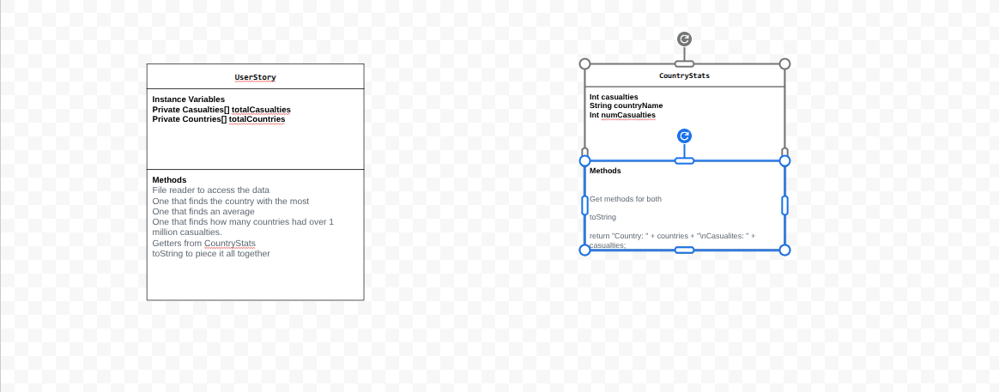

# Project-Data-for-Social-Good
# Unit 2 - Data for Social Good Project

## Introduction

Software engineers develop programs to work with data and provide information to a user. Each user has different needs based on the information they are looking for from data. Your goal is to create a data analysis program for your user that stores and analyzes data to provide the information they need.

## Requirements

Use your knowledge of object-oriented programming, one-dimensional (1D) arrays, and algorithms to create your data analysis program:
- **Write a class** – Write a class to represent your user or business and store and analyze their data with no-argument and parameterized constructors.
- **Create at least two 1D arrays** – Create at least two 1D arrays to store the data that your user needs information about.
- **Write a method** – Write a method that finds or manipulates the elements in a 1D array to provide the information your user needs.
- **Implement a toString() method** – Write a toString() method that returns general information about the data (for example, number of values in the dataset).
- **Document your code** – Use comments to explain the purpose of the methods and code segments and note any preconditions and postconditions.

## User Story 

Include your User Story you analyzed for your project here. Your User Story should have the following format: 

> As a world history enjoyer,   
> I want to analyze casualties by country in WW2,   
> so that I can understand the scale of human cost during the war.

## Dataset 

Include a hyperlink to the source of your dataset used for this project. Additionally, provide a short description of each column used from the dataset, and the data type. 

Example: 

Dataset: https://www.kaggle.com/datasets/notkrishna/world-war-2-causalities-by-country/data
- **Country** (String) - name of the country
- **Total population as of start of 1939** (int) - number of people in the country at start of 1939, when WW2 began. 
- **Military deaths from all causes including causes other than war** (int) - total military casualties.
- **Civilians due to military and crimes against humanity** (int) total civilians that died at the hands of war.
- **Total Deaths** (int) total deaths per country.
- **Death % compared to population at the start of war** (int) Percentage of population at start of 1939 that perished.
- **Average Deaths % compared to population at the start of war**(int) Average percentage of population at start of 1939 that perished.(used when amount is an interval or range, not singular value).
- **Military Wounded** (int) amount of soldiers that were wounded.

## UML Diagram 

Put an image of your UML Diagram here. Upload the image of your UML Diagram to your repository, then use the Markdown syntax to insert your image here. Make sure your image file name is one work, otherwise it might not properly get displayed on this README. 

 

## Description 

Write a description of your project here. In your description, include as many vocab words from our class to explain your User Story, the chosen dataset and how your project addressed that users goals. If your project used the Scanner class for user input, explain how the user will interact with your project.

As world history enthusiasts, we aimed to create a program focused on WW2, the grandest and most devastating war in modern day history. We at first searched for any datasets that were relevant to this topic, and there were not too many options. After traversing through websites such as Kaggle, we found a dataset. This dataset was about casualties in WW2, and we settled with this option. In our UserStory, we created an Array, called Stats, and then added the information from the countries.txt and casualties.txt usings fileReaders to read each respective text files' information type. We then set arrays for each text file's information type, and created a CountryStats array called StatsArray, set to be the length of countries.length. We then added the information into the StatsArray, with each element having a country name and amount of casualties, utilizing a for-loop to do so. 

Our questions were the following:
What country had the most casualties?
What was the average number of casualties per country in the world?
How many countries had over one million casualties?

We answered these questions using getter methods. We then used a toString method to allow us
to display our results in a readable manner.

